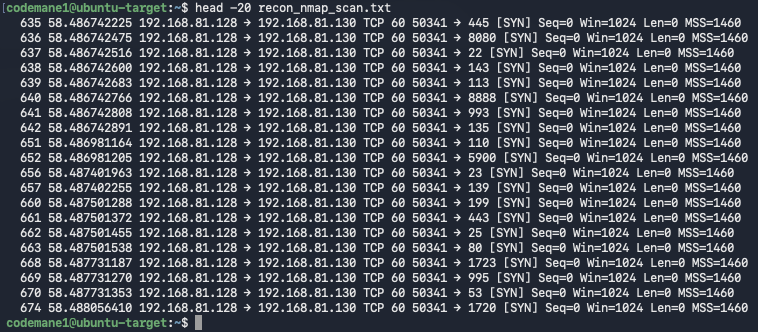
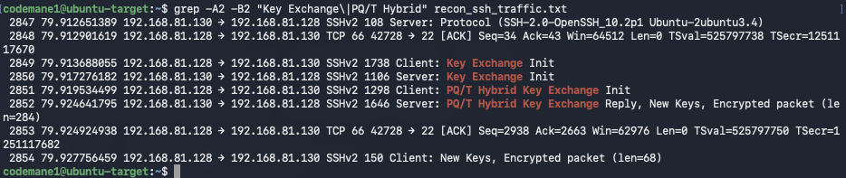
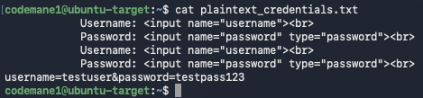
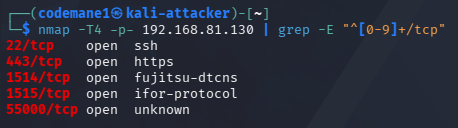
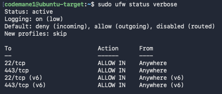
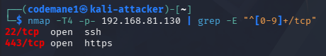

# Packet Capture & Traffic Analysis

## What this demonstrates
Ability to capture, filter, and interpret network traffic using Wireshark/tshark — including identifying a port scan, distinguishing what is and isn't visible in encrypted traffic, and demonstrating a real credential-exposure risk through a controlled test scenario.

## Environment
- **Attacker:** Kali Linux (`192.168.81.128`)
- **Target:** Ubuntu Server (`192.168.81.130`)
- **Network:** Isolated lab network (VMware Fusion, host-only), no internet-facing exposure
- **Capture method:** `tshark` (CLI) — target is a headless server install, no GUI available

## Tools used
- Wireshark / tshark
- Nmap
- OpenSSH
- Python 3 (custom minimal HTTP server for the credential-exposure scenario)

## Process

### 1. Reconnaissance capture — Nmap scan + SSH login attempts

Started a capture on the target's active interface, then from the attacker VM ran an Nmap service-version scan followed by several intentionally failed SSH login attempts.

```bash
tshark -i enp2s0 -w recon_capture.pcap
```
```bash
nmap -sV -T4 192.168.81.130
ssh codemane1@192.168.81.130   # wrong password x2-3
```

**Filtered scan traffic:**
```bash
tshark -r recon_capture.pcap -Y "tcp.flags.syn == 1 && tcp.flags.ack == 0 && ip.src == 192.168.81.128" > recon_nmap_scan.txt
```
Result: ~1,000 SYN packets fired against the target in well under 100ms, all from a single ephemeral source port on the attacker machine — consistent with Nmap's default top-1000-port sweep. Port 22 was included in that initial burst; a separate, slower full TCP handshake to port 22 followed shortly after, matching `-sV`'s two-phase behavior (fast sweep first, then a deeper connection to grab the service banner/version).

**Filtered SSH traffic:**
```bash
tshark -r recon_capture.pcap -Y "tcp.port == 22" > recon_ssh_traffic.txt
```
Result: full TCP handshake, SSH version exchange, and key negotiation are all visible — including a post-quantum hybrid key exchange (ML-KEM768 + X25519), confirming a modern OpenSSH version on both ends. Everything after the key exchange is encrypted: packet sizes, timing, and connection patterns are observable, but no credential or session content is readable. This is SSH behaving exactly as designed.

### 2. Plaintext credential capture

To directly contrast with the encrypted SSH traffic, stood up a minimal Python HTTP server serving a basic login form with no TLS:

```python
# server.py — minimal plaintext login form, lab use only
from http.server import BaseHTTPRequestHandler, HTTPServer
from urllib.parse import parse_qs

class Handler(BaseHTTPRequestHandler):
    def do_GET(self):
        self.send_response(200)
        self.send_header("Content-type", "text/html")
        self.end_headers()
        self.wfile.write(b"""
        <form method="POST">
            Username: <input name="username"><br>
            Password: <input name="password" type="password"><br>
            <input type="submit">
        </form>
        """)

    def do_POST(self):
        length = int(self.headers["Content-Length"])
        body = self.rfile.read(length).decode()
        creds = parse_qs(body)
        print(f"Captured login attempt: {creds}")
        self.send_response(200)
        self.end_headers()
        self.wfile.write(b"Login received (lab only)")

HTTPServer(("0.0.0.0", 8080), Handler).serve_forever()
```

Captured a fresh session while submitting a test login (`testuser` / `testpass123`) from the attacker VM's browser:

```bash
tshark -i enp2s0 -w plaintext_capture.pcap
```

Rather than relying on Wireshark's HTTP dissector output alone, confirmed the exposure the most direct way possible — searching the raw capture file for readable text:

```bash
strings plaintext_capture.pcap | grep -i "username\|password"
```

Result:
```
username=testuser&password=testpass123
```

No decryption, no specialized tooling — the submitted credentials are sitting in the capture file as plain, readable ASCII text.

## Key finding

This capture set puts two authentication mechanisms side by side, under identical network conditions:

| | SSH | Plaintext HTTP |
|---|---|---|
| What an on-path observer sees | Connection metadata, timing, packet sizes | The exact username and password |
| Effort required to read credentials | Not possible without breaking modern encryption | A single `strings` command |

The difference isn't the network — it's entirely whether the application layer encrypts its traffic. This is the core argument for enforcing TLS everywhere, including "internal-only" tools that feel low-risk because they're not internet-facing.

## What a defender would do about this

- **Never serve authentication forms over plain HTTP** — enforce HTTPS/TLS on every service handling credentials, internal or external.
- **Rate-limit or lock out repeated failed SSH attempts** (e.g., fail2ban) — SSH's encryption protects credential *content*, but doesn't stop brute-force attempts on its own.
- **Monitor for SYN-packet bursts against many ports in a short window** — a reliable, low-noise signature of port-scanning activity that a SIEM or IDS can flag automatically rather than requiring manual capture review.

## Files in this repo

- `server.py` — the plaintext login form used for the credential-exposure scenario (lab use only, never expose outside an isolated network)
- `recon_nmap_scan.txt` — filtered Nmap SYN scan traffic
- `recon_ssh_traffic.txt` — filtered SSH session traffic
- `plaintext_credentials.txt` — filtered HTTP POST traffic
- `nmap_before_firewall_full.txt` — full 65535-port scan prior to firewall hardening (see addendum below)
- `nmap_after_firewall_full.txt` — full 65535-port scan after firewall hardening
- `screenshots/` — terminal output captures (see below)

## Screenshots








## What I'd do differently in production

- Automate this kind of encrypted-vs-unencrypted comparison as a recurring internal check rather than a one-off manual exercise, to catch cleartext services before they reach production.
- Pair packet-level detection like this with a SIEM (see the [`siem-home-lab`](https://github.com/JSON-MSON/siem-home-lab) project in this portfolio) so a real port scan or credential-exposure event triggers an automated alert instead of requiring someone to manually pull and filter a capture after the fact.

---

## Addendum: Firewall Hardening + Measured Attack Surface Reduction

### What this adds

A direct, quantified callback to this project's own original scan: re-running the identical reconnaissance technique against the same target, before and after enabling a default-deny firewall, to measure the actual reduction in attack surface rather than just assert one.

### Why a full port-range scan, not the original default-range one

A default Nmap scan only checks the 1000 most common ports. Checking the machine's actual listening sockets first (`ss -tulnp`) revealed real services outside that range — `1514`, `1515` (Wazuh agent-enrollment ports), and `55000` (Wazuh's manager API) — meaning a default-range scan would have shown *no difference at all* before and after hardening, since it never saw those ports in either state. The comparison had to check the full range to be genuinely meaningful:

```bash
nmap -sV -T4 -p- 192.168.81.130
```

### Deciding what to actually allow, based on real usage — not just SSH by default

Before writing any firewall rule, the machine's actual bound sockets were checked directly:
```bash
sudo ss -tulnp | grep LISTEN
```
Two ports had genuine, demonstrated real-world use: `22` (SSH, actively used throughout this entire lab) and `443` (the Wazuh dashboard, actively used in Project 2). The Wazuh-specific ports (`1514`, `1515`, `55000`) had no current real usage — B.1's Windows agent work was deferred, meaning nothing external currently depends on them — so they were deliberately left closed rather than opened "just in case."

### Applying the rule

```bash
sudo ufw default deny incoming
sudo ufw allow 22/tcp
sudo ufw allow 443/tcp
sudo ufw enable
```

### Result — measured, not assumed

**Before:** 5 ports open (`22`, `443`, `1514`, `1515`, `55000`)
**After:** 2 ports open (`22`, `443`)

Confirmed via the identical full-range scan run both times, with `ufw status verbose` independently confirming the active ruleset matched what was intended.

### Key finding

Attack-surface reduction claims are only as credible as the scan used to measure them — a default-range scan here would have shown zero change and produced a false "nothing to fix" impression, when in fact three real, unused ports were open the entire time. Checking actual listening sockets before deciding firewall rules, and using a full-range scan for the comparison, is what makes this a genuine before/after measurement rather than an assumption dressed up as one.